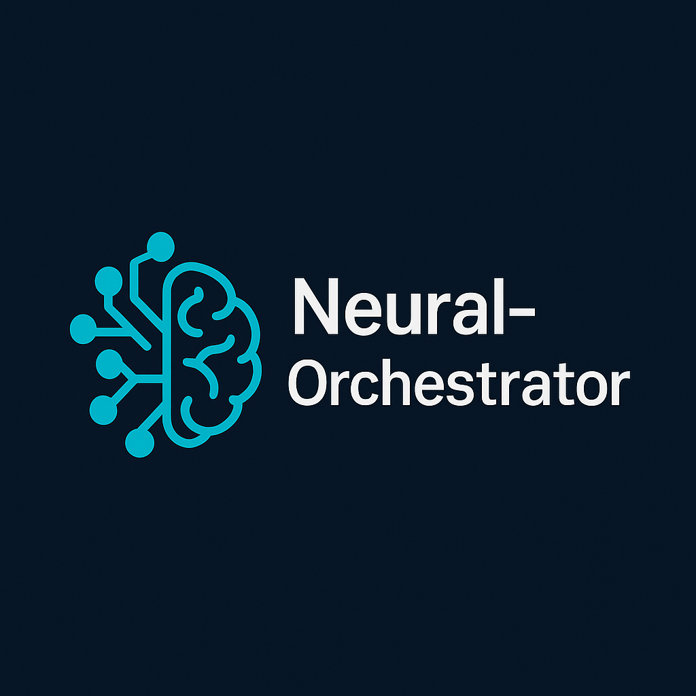
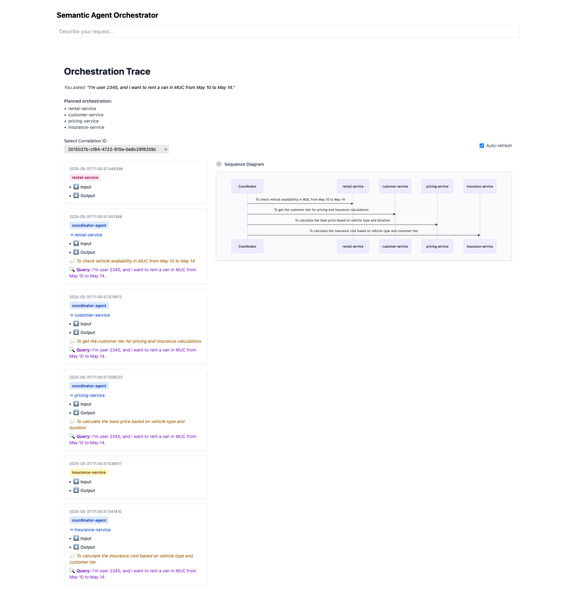
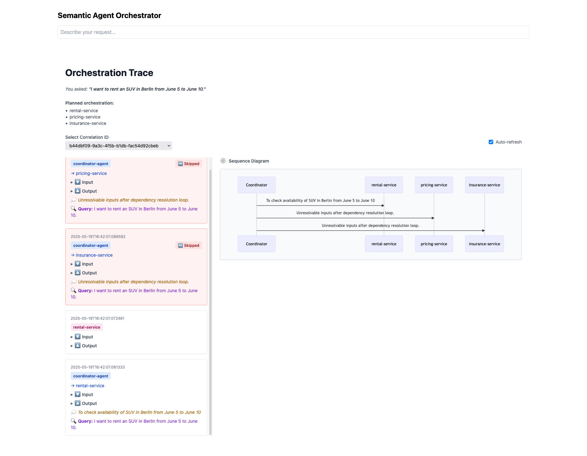
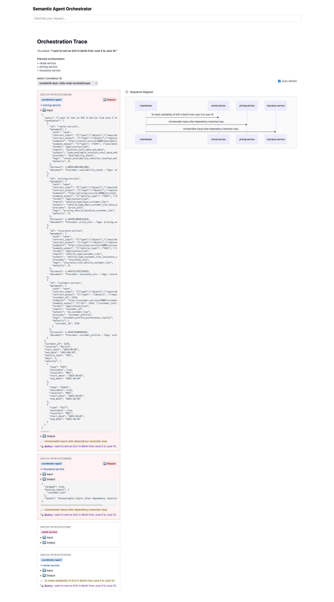

# 🧠 Chroma Agent Orchestrator

A lightweight **multi-agent orchestration system** using LLMs, declarative service contracts, and semantic service discovery powered by ChromaDB.

<p align="center">
  
</p>

---

## 🎯 TL;DR

This is your AI-powered conductor for backend service automation.

Speak to it in plain English—"Find me an SUV for a premium customer in Munich"—and watch it:
1. Understand your intent with an LLM
2. Discover matching services via semantic search
3. Chain them into an executable pipeline
4. Dispatch requests with proper contracts
5. Return the final result with full traceability

---


## 🧱 Architecture Overview

```plaintext
User Query → LLM (via LM Studio)
            ↓
    ChromaDB Contract Lookup
            ↓
   Dependency Resolver (topo sort)
            ↓
   Service Execution Loop & Trace Logging
            ↓
    Final Result + Execution Summary
```

- 🔍 Uses **semantic embeddings** to find services
- ⚖️ Resolves dependencies based on input/output contracts
- 🔁 Executes only needed services, in order
- 🧾 Logs every step for traceability

---

## 🧰 Tech Stack

| Tool/Tech         | Purpose                                |
|-------------------|----------------------------------------|
| FastAPI           | Coordinator service API                |
| LM Studio (LLM)   | Natural language understanding         |
| ChromaDB          | Semantic service discovery             |
| JSON Schema       | Contract-driven validation             |
| Docker            | Containerized deployment               |
| React (stub)      | Frontend concept & trace viewer (WIP)  |

---

## 📦 Repository Structure

```plaintext
chroma-agent-orchestrator/
├── chroma-agents/         # Service definitions + ChromaDB bootstrapper
├── coordinator_agent/     # Main orchestrator using FastAPI + LLM
├── frontend/              # Stubbed UI (planned trace viewer)
└── README.md              # You're here
```

---

## 🚀 Quick Start

### 1. Start LM Studio (LLM)

```bash
export LMSTUDIO_URL=http://localhost:1234
```

---

### 2. Bootstrap ChromaDB

```bash
cd chroma-agents
docker build -t chroma-bootstrap .
docker run --rm -v $PWD:/app chroma-bootstrap     --source /app     --host <chroma-host>     --port 8000     --collection services
```

---

### 3. Launch the Coordinator

```bash
cd coordinator_agent
uvicorn main:app --reload --port 7000
```

`.env` variables (or export directly):

```env
LMSTUDIO_URL=http://localhost:1234
chat_model=swe-dev-32b-i1
embed_model=text-embedding-all-minilm-l12-v2
CHROMA_AGENTS_URL=http://localhost:8000
SERVICE_SELECTION_SYSTEM_PROMPT=prompts/serviceSelectionSystem.txt
SERVICE_SELECTION_USER_PROMPT=prompts/serviceSelectionUser.txt
```

---

## 🧪 Roadmap

- [ ] Semantic service recommender
- [ ] Step-by-step service playback
- [ ] Model switching + fallback support

---

## 📜 License

MIT (or your license of choice)

---

## 🖼️ Execution Trace Gallery

### ✅ Full Successful Orchestration



---

### ⚠️ Partial Failure with Unresolvable Inputs



---

### 🧪 Contract Inspection During Failure



---
